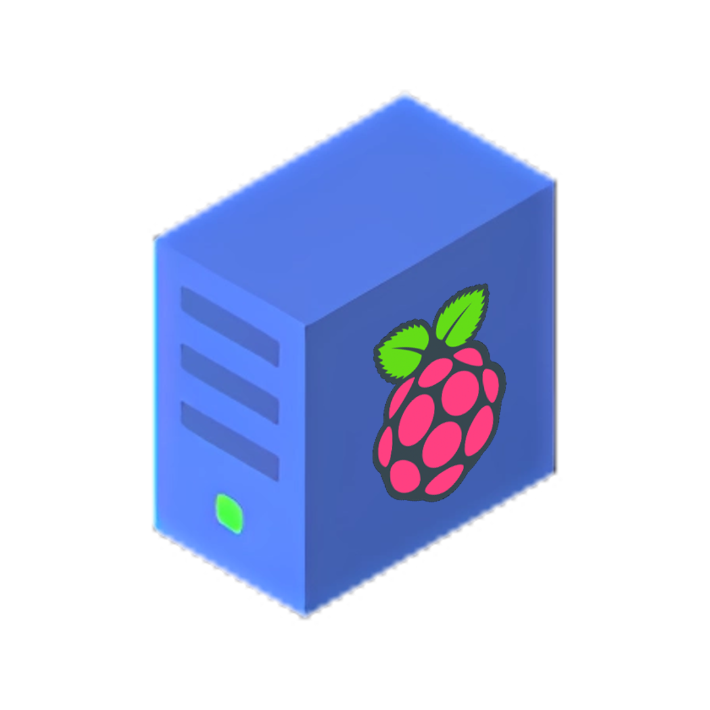

# Storage Pi

<p align="center">
  
</p>

Welcome to My Awesome Project! This project is designed to [brief description of your project]. 

## Features

- Simple to use
- Easy to install
- Customizable UI

## Getting Started

To get started with this StoragePi, follow these steps:

1. SSH Into your Raspberry Pi.
2. Type ```sudo -i``` to grant root access.
3. Run the command ```curl -sSL https://raw.githubusercontent.com/StoragePi-Official/Storage-Pi/main/install.sh | bash```.
4. You will need to wait until the install is completed.

## Usage

Here's how you can access the dashboard :

1. Run the StoragePi installer.
2. When it finished running, copy the URL it returned, it may looks like that : ```http://127.0.0.1/Storage-Pi/HTML/```.
3. Enter this URL on a web browser, and you're connected to your StoragePi server.

## Contributions

Contributions are welcome! If you'd like to contribute to this project, please follow these guidelines:

1. Fork the repository.
2. Create a new branch for your feature/bug fix.
3. Make your changes and commit them with descriptive messages.
4. Push your changes to your fork.
5. Submit a pull request to the main repository.

## Support

If you encounter any issues or have any questions about this project, please feel free to contact us at [your email address].

## License

This project is licensed under the [License Name]. See the [LICENSE](./LICENSE) file for details.

## Acknowledgements

We'd like to thank the following individuals/groups for their contributions to this project:

- [Name 1]
- [Name 2]
- [Name 3]
